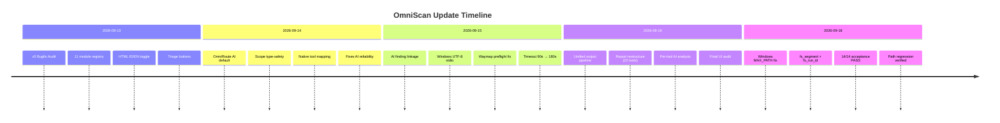
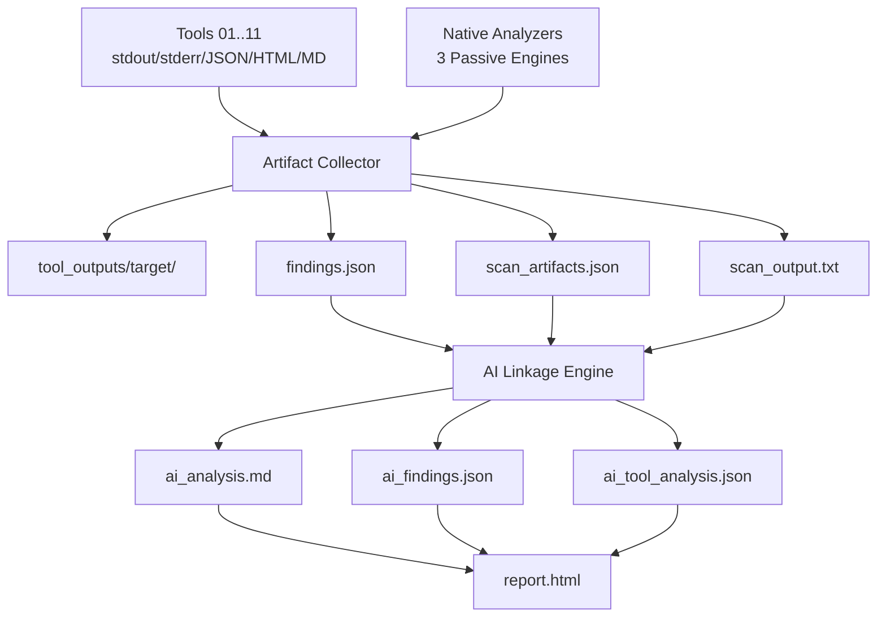
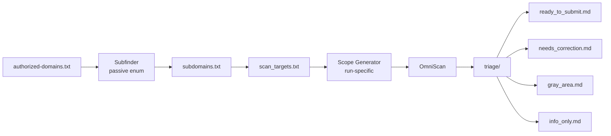

# 🛡️ OmniScan Web Mass Framework

<div align="center">


**Automated • Asynchronous • Multi-Target • Scope-Controlled Security Assessment Framework**

[](https://www.python.org/)
[]()
[]()
[]()
[]()
[]()
[]()

> Framework assessment keamanan **Web Application & Web API** untuk penetration testing resmi, internal security assessment, staging/dev/lab environment, dan bug bounty yang secara eksplisit mengizinkan automated scanning.

</div>

---

## 📑 Daftar Isi

- [🎯 Dua Fitur Utama](#-dua-fitur-utama)
- [🆕 Update Terbaru](#-update-terbaru)
- [✨ Fitur Unggulan](#-fitur-unggulan)
- [🧩 11 Reference-Inspired Modules](#-11-reference-inspired-modules)
- [🗂️ Struktur Project](#️-struktur-project)
- [🖥️ Instalasi](#️-instalasi)
- [📖 Contoh Penggunaan](#-contoh-penggunaan)
- [📋 CLI Reference](#-cli-reference)
- [📊 Report Output](#-report-output)
- [🛡️ Safety Boundaries](#️-safety-boundaries)
- [🧪 Validation Status](#-validation-status)
- [📜 Changelog](#-changelog)
- [⚖️ Disclaimer](#️-disclaimer)

---

## 📸 Preview Antarmuka

<div align="center">

| 🖥️ Dashboard Report | 🔍 Finding Detail | 🤖 AI Analysis |
|:---:|:---:|:---:|
|  |  |  |

</div>

---

## 🎯 Dua Fitur Utama

OmniScan memiliki **dua fitur operator-facing** yang terpisah dan jelas.

<table>
<tr>
<td width="50%" valign="top">

### 🚀 1. MASS SCAN

Scan banyak target sekaligus dari satu file list.

```bat
python main.py mass -i targets.txt
```

atau:

```bat
scan_mass.bat
```

**Karakteristik:**
- 📦 Satu `scan_id` untuk semua target
- 📁 Satu folder report terpusat
- ⚡ Paralel sesuai `concurrency` di `config.json`
- 🎯 Cocok untuk inventory menyeluruh

**Contoh `targets.txt`:**
```text
https://example-one.test
https://example-two.test
https://api.example-three.test
```

</td>
<td width="50%" valign="top">

### 🎯 2. SINGLE SCAN

Fokus ke satu URL/domain saja.

```bat
python main.py single -u https://example.com
```

atau:

```bat
scan_single.bat https://example.com
```

**Karakteristik:**
- 🎯 Satu target saja (wajib tepat 1 URL)
- 🚫 **Tidak** baca `targets.txt`
- 🚫 **Tidak** jalankan Subfinder
- 🚫 **Tidak** jalankan workflow enumerasi subdomain
- 📁 Punya `scan_id` & folder report sendiri

</td>
</tr>
</table>

> ⚡ **Catatan:** Single Scan tetap dapat melakukan crawling URL/path pada target sesuai `scope.json`, namun target awal tetap hanya satu domain/URL.

---

## 🆕 Update Terbaru

### Timeline Evolusi OmniScan



---

### 🔥 Highlight Update Terkini

<table>
<tr>
<td align="center" width="25%">

### 🪟
**Windows MAX_PATH Fix**
<br/>
<b>2026-09-18</b>
<br/><br/>
Path panjang & karakter invalid sudah diatasi dengan `fs_segment()` dan `fs_run_id()`

</td>
<td align="center" width="25%">

### 📊
**Report Restructure**
<br/>
<b>2026-09-16</b>
<br/><br/>
22 report-visible tools (11 external + 11 native analyzer)

</td>
<td align="center" width="25%">

### 🤖
**AI Pipeline Unifikasi**
<br/>
<b>2026-09-16</b>
<br/><br/>
Per-tool AI + global synthesis + finding linkage deterministik

</td>
<td align="center" width="25%">

### 🔐
**Secrets Engine**
<br/>
<b>v9+</b>
<br/><br/>
Deteksi API tokens, DSN, private keys, PII, internal hosts

</td>
</tr>
</table>

---

## ✨ Fitur Unggulan

### 🧠 1. AI Analysis — OmniRoute Local (OpenAI-Compatible)

<div align="center">


</div>

**Default backend:**
- 🔗 Endpoint: `http://localhost:20128/v1/chat/completions`
- 🎛️ Model virtual: `auto`
- 🔑 Header: `Authorization: Bearer <API_KEY>`
- 📨 Format: POST JSON dengan `messages`

**Aktivasi via environment:**

```bat
set OMNISCAN_AI_ENABLED=1
set OMNISCAN_AI_API_KEY=<API_KEY>
```

**Aktivasi via CLI (one-run override):**

```bash
python main.py single -u https://target.example \
  --ai-analyze \
  --ai-apikey YOUR_KEY \
  --ai-endpoint http://localhost:20128/v1/chat/completions \
  --ai-model auto
```

**Output AI:**

| File | Deskripsi |
|------|-----------|
| 📄 `ai_analysis.md` | Arsip global analisis AI |
| 📊 `ai_findings.json` | Mapping per-finding ke fingerprint |
| 🧾 `ai_tool_analysis.json` | Analisis AI per-tool |
| 🧩 `ai_finding_index.json` | Compatibility alias untuk `ai_findings.json` |
| 🌐 **AI Analysis (Embedded)** | Langsung tertanam di `report.html` |

> 🎓 **Untuk dosen/reviewer:** cukup buka **satu** `report.html` untuk melihat ringkasan scan + findings + bukti tool + hasil AI.

**Fitur AI canggih:**
- ✅ Streaming chat completions (`stream=true`)
- ✅ Retry dengan exponential backoff
- ✅ Bounded evidence chunks + hierarchical synthesis
- ✅ `X-OmniRoute-No-Cache` & `x-omniroute-no-memory` headers
- ✅ Per-tool timeout budget (`tool_timeout=90`, `tool_retries=2`)
- ✅ API key **tidak pernah** ditulis ke source/config/report

---

### 🔐 2. Secrets Engine — `core/secret_scanner.py`

<div align="center">


</div>

Modul baru yang mendeteksi berbagai jenis secret dan data sensitif:

| Detektor | Contoh Target |
|----------|---------------|
| 🔑 API / Cloud Tokens | AWS, GitHub, Google, Slack, JWT |
| 🗄️ Database DSNs | `postgres://`, `mysql://`, `mongodb://` |
| 📜 Private Keys | PEM blocks (`-----BEGIN ...`) |
| 🛂 Auth Material | Bearer tokens, basic-auth strings |
| ⚙️ Sensitive Assignments | `password=`, `secret=`, `api_key=` |
| 👤 PII Indicators | Emails, phone numbers, NIK-like patterns |
| 🏠 Internal Hosts / IPs | `10.x`, `192.168.x`, internal hostnames |
| 🕵️ Sensitive Path Probes | `/.env`, `/.git/HEAD`, `/config.json` |

**Safety behavior:**

- 🚫 Live secret **selalu di-redact** di report utama → contoh: `AKIA********MNOP`
- ✅ Evidence lengkap disimpan di `secrets.json` (local artifact)
- 📍 Report mencatat **line & column** lokasi secret
- 🔒 Set `OMNISCAN_REDACT_SECRET_ARTIFACT=1` untuk masking penuh

**Standalone CLI:**

```bat
:: File
scan_secrets.bat file path/to/file

:: Folder
scan_secrets.bat folder path/to/folder

:: URL
scan_secrets.bat url https://example.test
```

---

### 📊 3. Report Restructure — 22 Tool/Engine Visible

<div align="center">


</div>

<table>
<tr>
<td valign="top" width="50%">

#### 🔧 11 Bundled External Tools

1. **CORScanner** — CORS misconfiguration
2. **HKsql** — SQL injection
3. **CVE-2021-20323** — Keycloak
4. **XSSCon** — XSS
5. **R2SAE** — React Server Actions
6. **IDOR-Forge** — IDOR
7. **LFI-Striker** — LFI
8. **SSRFPwned** — SSRF
9. **XSRFProbe** — CSRF
10. **Openredirex** — Open Redirect
11. **waymap** — Crawling

</td>
<td valign="top" width="50%">

#### 🧬 11 Native Analyzer Engines

12. **Sensitive Information Engine**
13. **Sensitive Information Exposure Engine**
14. **API Misconfiguration Engine**
15. **XXE Analyzer**
16. **Cryptography Analyzer**
17. **Transport Security Analyzer**
18. **Authentication & Session Analyzer**
19. **Content Discovery Engine**
20. **Hidden Parameter Discovery Engine**
21. **Authorization Analyzer**
22. **Business Logic Analyzer**

</td>
</tr>
</table>

---

### 🌐 4. HTML UI — Responsive & Interaktif

<div align="center">


</div>

**Fitur HTML report terbaru:**

- 🎛️ **Filter lengkap:** All Tools, All Categories, All Severities, All Confidence, All Status
- 🧾 **Tool column** di tabel findings
- 📂 **Finding Details:** Reference Tool + AI Analysis & Evidence + Scan Output
- 🧬 **Native Tool Outputs** — embed file/directory artifacts + link ke canonical paths
- 🇮🇩🇬🇧 **Toggle Bahasa** Indonesia / English (offline, local glossary)
- ✅ **Triage Lokal:** Ready to Report / Verify Again / Reset Marks
- 📱 **Responsive layout** — nyaman dibuka dari laptop maupun layar besar
- 🌓 **Self-contained** — tidak butuh internet, cukup double-click `report.html`
- 🎨 **Prioritas non-INFO findings** + compact vulnerable-target queue

---

### 📁 5. Unified Output Pipeline



**Setiap run report sekarang punya:**

```text
reports/<scan_id>/
├── report.html              🌐 Self-contained dashboard
├── report.md                📄 Markdown version
├── summary.json             📊 Ringkasan scan
├── findings.json            🔍 Semua findings
├── secrets.json             🔐 Evidence artifact (local)
├── ai_analysis.md           🧠 AI global analysis
├── ai_findings.json         🔗 AI ↔ finding mapping
├── ai_tool_analysis.json    🧾 AI per-tool analysis
├── ai_finding_index.json    🗂️ Compatibility alias
├── scan.log                 📝 Log lengkap
├── scan_output.txt          📜 Combined transcript
├── scan_artifacts.json      📦 Artifact manifest
├── tool_runs.json           🛠️ Tool run metadata
├── attack_surface.json      🗺️ Crawled paths inventory
├── attack_surface.md        🗺️ Human-readable version
├── tool_runs.md             🛠️ Tool runs (Markdown)
├── external-tools/          📁 External tool staging
└── tool_outputs/<target>/   📁 Per-target staged outputs
    ├── XSSCon.stdout.txt
    ├── XSSCon.stderr.txt
    └── ...
```

---

### 🪟 6. Windows MAX_PATH Fix (2026-09-18)

<div align="center">


</div>

**Root cause:**

Internal analyzer IDs seperti `core:sensitive-info-exposure` dan run IDs panjang `internal_scan_<scan_id>_<index>_<tool_id>` dipakai langsung sebagai nama direktori → berpotensi melebihi **260 karakter** MAX_PATH Windows dan/atau mengandung karakter invalid.

**Fix yang diterapkan:**

- ✅ `fs_segment()` — komponen path Windows-safe & bounded
- ✅ `fs_run_id()` — mapping logical tool-run ID → short deterministic dir ID
- ✅ Logical `tool_id` & `tool_run_id` tetap utuh di JSON/provenance metadata
- ✅ Safe path helpers diterapkan ke external tool staging & internal analyzer staging
- ✅ Canonical finding ID sekarang include `tool_run_id` → no collision

**Verifikasi:**

| Check | Result |
|-------|:------:|
| `python -m compileall -q .` | ✅ PASS |
| `python -m unittest -v tests.test_acceptance` | ✅ 14/14 PASS |
| Synthetic `stage_and_build()` dengan long path | ✅ PASS |
| Synthetic `stage_run()` dengan long internal run-id | ✅ PASS |
| Child path length < 260 chars di Windows regression | ✅ PASS |

> **Catatan:** Logical provenance tetap tidak berubah; hanya nama direktori fisik yang diperpendek.

---

### 🎯 7. Evidence-First PoC Output

Setiap finding di `report.html` / `report.md` sekarang berisi **5-part block** siap paste ke bug bounty platform (YesWeHack, HackerOne, dll):

<table>
<tr>
<td width="20%" align="center">📋<br/><b>Description</b></td>
<td>Vulnerability class + instance spesifik yang OmniScan observasi</td>
</tr>
<tr>
<td width="20%" align="center">⚔️<br/><b>Exploitation</b></td>
<td>Metodologi verifikasi class-level (level OWASP/PortSwigger), bukan bespoke attack</td>
</tr>
<tr>
<td width="20%" align="center">🧪<br/><b>PoC</b></td>
<td>Request/response detail yang OmniScan capture di target</td>
</tr>
<tr>
<td width="20%" align="center">⚠️<br/><b>Risk</b></td>
<td>Impact umum jika finding terkonfirmasi</td>
</tr>
<tr>
<td width="20%" align="center">🛠️<br/><b>Remediation</b></td>
<td>Fix guidance</td>
</tr>
</table>

**Ditambah:**

- ✅ **Verification status:** `CONFIRMED BY TOOL` / `VERIFICATION SUPPORTED` / `INDICATOR / REVIEW`
- 🎯 **Affected URL + parameter** yang jelas
- 🪟 **Windows CMD / PowerShell** (`curl.exe`) command
- 🐧 **Linux/macOS** (`curl`) command
- 🎯 **Confirmation criteria** — apa yang harus dicek di response
- 🔬 **Observed evidence** — excerpt dengan masking
- 📖 **Risk & remediation**

**Contoh output (missing security header):**

```text
Verification status: VERIFICATION SUPPORTED

Affected URL : https://target.example/login
Parameter    : N/A
Category     : HTTP Security Headers
Confidence   : HIGH

Windows CMD (curl.exe):
curl.exe -kIv "https://target.example/login"

Linux/macOS:
curl -kIv "https://target.example/login"

What confirms the finding:
Confirmed when the named security header is absent from the response
and the omission is relevant to the application.

Observed evidence from this scan:
HTTP/2 200
content-type: text/html
x-content-type-options: nosniff

Evidence: header=Strict-Transport-Security; absent
```

**Contoh output (reflected XSS):**

```text
Windows CMD (curl.exe):
curl.exe -sS -i "https://target.example/search?q=omniscanxss7f3%3C%3E"

Linux/macOS:
curl -sS -i "https://target.example/search?q=omniscanxss7f3%3C%3E"

What confirms the finding:
The harmless marker must be reflected at the reported parameter/context
without appropriate HTML/contextual encoding. Reflection alone is not
proof of script execution; inspect the exact sink/context.
```

> 🎯 **Perbedaan kunci:** OmniScan membedakan jelas antara **apa yang sudah dibuktikan** vs **yang masih butuh validasi manual**.

---

### 🌐 8. One-Click Multi-Domain Workflow

<div align="center">


</div>



**Jalankan:**

```bash
# Linux/macOS
python3 one_click.py --domains targets.txt
python3 one_click.py --domains targets.txt --subfinder-all
python3 one_click.py --domains targets.txt --active
```

```bat
:: Windows
one_click.bat --domains targets.txt --active
```

**Triage categories:**

| Kategori | Arti |
|----------|------|
| ✅ **READY TO SUBMIT** | Scanner mengonfirmasi meaningful security condition dengan evidence |
| ⚠️ **NEEDS CORRECTION** | Evidence kuat tapi impact, konteks otorisasi, atau policy program masih butuh validasi manual |
| 🔍 **GRAY AREA** | Hanya heuristic / surface indicator |
| ℹ️ **INFO ONLY** | Fingerprint atau observasi informasional tanpa confirmed vuln |

---

### 🔄 9. Native Tool Adapters (v5)

<div align="center">


</div>

<table>
<tr>
<td valign="top" width="50%">

#### ✅ Automatic, Bounded Adapters
- **CORScanner** — CORS checks
- **XSSCon** — XSS checks
- **OpenRedireX** — open redirect checks

Capture exit code + stdout + stderr, terapkan global/per-domain rate limiting.

</td>
<td valign="top" width="50%">

#### 🔒 Manual / Lab Adapters
- **HKsql** — SQL injection
- **CVE-2021-20323** — Keycloak
- **R2SAE** — React Server Actions
- **IDOR-Forge** — IDOR
- **LFI-Striker** — LFI
- **SSRFPwned** — SSRF
- **XSRFProbe** — CSRF

Registered di report, **tidak** auto-launch di mass mode.

</td>
</tr>
</table>

**Native tool mapping (2026-09-14):**

```text
SQLi    → external_tools/Kumpulan-Tools-Security/HKsql/sql.py -u <URL>
IDOR    → external_tools/Kumpulan-Tools-Security/IDOR-Forge/idorforge.py -u <URL>
LFI     → external_tools/Kumpulan-Tools-Security/LFI-Striker/lfiforge.py -u <URL>
XSRF    → bundled XSRFProbe audit mode (crawl, no-form-submit, skip-poc)
Waymap  → external_tools/Kumpulan-Tools-Security/waymap/waymap.py --url <URL> --crawl 2
```

> ⚠️ SSRF tetap manual sampai ada `ssrf_forge.py` executable yang disuplai.

---

### 📚 10. XXE Reference

`Cheatsheets/XXE.md` disimpan sebagai reference material — terdaftar sebagai `MANUAL_REVIEW` di report, didokumentasikan di `docs/XXE_REFERENCE.md`.

---

## 🧩 11 Reference-Inspired Modules

| # | Module | Active? | Gate / Approach |
|---|--------|:-------:|-----------------|
| 1 | **CORS Scanner** | ✅ | `authorized_active` + `enable_active_cors` |
| 2 | **SQL Injection Scanner** | ✅ | `authorized_active` + `enable_active_parameter_checks` + `enable_active_sqli` |
| 3 | **Keycloak CVE Triage** | 🔍 | Passive + fixed safe discovery paths |
| 4 | **XSS Scanner** | ✅ | `authorized_active` + `enable_active_parameter_checks` + `enable_active_xss` |
| 5 | **React Server Actions RCE** | 🔍 | Fingerprint only, no RCE payloads |
| 6 | **IDOR Scanner** | 🔍 | Surface discovery, no bypass attempt |
| 7 | **LFI Scanner** | 🔍 | File/path param detection, no traversal |
| 8 | **SSRF Scanner** | 🔍 | Fetch sink classification |
| 9 | **XXE Scanner** | 🔍 | Parser surface, no entity-expansion |
| 10 | **Open Redirect Fuzzer** | ✅ | `authorized_active` + `enable_active_open_redirect` |
| 11 | **CSRF Scanner** | 🔍 | Form/token surface, no submission |

### 🔒 Safety Gate untuk Active Checks

Semua active check bersifat **non-destructive**:

- ❌ Tidak ada brute-force credentials
- ❌ Tidak ada SQL extraction / UNION query
- ❌ Tidak ada script execution / shell command
- ❌ Tidak ada file reads di luar fixed well-known paths
- ❌ Tidak ada state-changing request
- ❌ Tidak ada credential/account attack
- ❌ Tidak ada browser payload / RCE payload

### 📋 Verification Playbook

| # | Module | Stronger Confirmation Signal |
|---|--------|------------------------------|
| 1 | CORS | Untrusted origin reflected pada sensitive endpoint |
| 2 | SQLi | Reproducible DB-specific error / stable input-linked differential |
| 3 | Keycloak CVE | Exact deployed build matches affected advisory range |
| 4 | XSS | Marker reaches executable context tanpa encoding |
| 5 | RSC/Next.js | Exact affected framework/build correlation |
| 6 | IDOR | Dua authorized resources demonstrate cross-boundary access |
| 7 | LFI | Authorized benign fixture dapat dipilih via input-controlled path |
| 8 | SSRF | Approved canary/collaborator demonstrates server-side request |
| 9 | XXE | Controlled fixture confirms external entity processing |
| 10 | Open Redirect | Location points to external reserved destination tanpa allowlist |
| 11 | CSRF | Server accepts state-changing request tanpa effective anti-CSRF |

---

## 🗂️ Struktur Project

```text
OmniScan/
├── 📄 main.py                         # Entry point (mass + single)
├── 🎯 one_click.py                    # Subfinder → OmniScan orchestration
├── 🧠 ai_analyze.py                   # Standalone AI analysis CLI
├── ⚙️ config.json                     # Konfigurasi scan
├── 🔒 scope.json                      # Authorization scope
├── 🎯 targets.txt                     # Daftar target mass scan
├── 📜 authorized-domains.txt          # Root domains untuk one_click
├── 📜 requirements.txt
├── 📄 .env.example                    # Template environment AI
│
├── 🖱️ install.bat                     # Installer Windows
├── 🖱️ install_external_tools.bat      # Setup external tools
├── 🖱️ run.bat                         # Menu interaktif
├── 🖱️ scan_mass.bat                   # Mass scan
├── 🖱️ scan_single.bat                 # Single scan
├── 🖱️ scan_secrets.bat                # Standalone secrets scan
├── 🖱️ one_click.bat                   # One-click workflow
│
├── 📁 core/
│   ├── 🧬 analyzer.py                 # 21 kategori passive analysis
│   ├── 🕷️ crawler.py                  # Scope-aware BFS crawler
│   ├── 🔐 secret_scanner.py           # Secrets detection engine
│   ├── 🔎 scope.py                    # Fail-closed scope enforcement
│   ├── 📊 reporting.py                # HTML/MD/JSON/CSV reports
│   ├── 🤖 ai_analyzer.py              # OmniRoute integration
│   ├── 💾 database.py                 # Async SQLite (aiosqlite)
│   ├── 🎯 scanner.py                  # Orchestration engine
│   ├── 📚 vuln_reference.py           # Exploitation/risk reference
│   ├── 🔍 param_discovery.py          # Arjun-style (opt-in)
│   ├── 🔍 content_fuzzer.py           # ffuf-style (opt-in)
│   ├── 🎛️ module_registry.py          # External + supplemental modules
│   ├── 📏 rate_limit.py               # Global + per-domain limits
│   └── 🛠️ utils.py                    # URL normalization, logging, masking
│
├── 📁 external_tools/
│   ├── Kumpulan-Tools-Security/       # 11 bundled professor tools
│   └── professor_bundle_manifest.json
│
├── 📁 config/
│   └── AI_SYSTEM_PROMPT.md            # AI system prompt
│
├── 📁 docs/
│   └── XXE_REFERENCE.md
│
├── 📁 data/
│   ├── omniscan.db                    # SQLite findings store
│   └── keycloak_cve_fingerprints.json
│
├── 📁 reports/<scan_id>/              # Hasil scan per-run
├── 📁 runs/one_click/                 # One-click workflow output
├── 📁 logs/omniscan.log
└── 📁 tests/
    └── test_acceptance.py             # 14 acceptance tests
```

---

## 🖥️ Instalasi

### 📋 Prasyarat

- **Python 3.11+** (wajib)
- **Windows 10/11**, Linux, atau macOS
- **Java + Maven** (opsional, untuk LFI-Striker)
- **Subfinder** (opsional, untuk one_click workflow)

### 🪟 Windows — One-Click Installer

```bat
:: 1. Ekstrak folder OmniScan
:: 2. Double-click
install.bat

:: Installer akan:
::   - Deteksi Python 3.11+
::   - Install via winget jika belum ada
::   - Buat .venv
::   - Install dependencies
::   - Setup external tools
::   - Verifikasi critical imports
::   - Buat direktori data/logs/reports

:: 3. Edit targets.txt dan scope.json
:: 4. Double-click
run.bat
```

### 🐧 Linux / macOS

```bash
# 1. Clone / ekstrak folder
cd OmniScan

# 2. Setup virtual environment
python3 -m venv .venv
source .venv/bin/activate

# 3. Install dependencies
pip install -r requirements.txt

# 4. Jalankan
python3 main.py mass -i targets.txt
```

### 🔧 Install External Tools (Opsional)

```bat
:: Windows
install_external_tools.bat
```

```bash
# Linux/macOS — install per-tool
python -m pip install -r external_tools/Kumpulan-Tools-Security/CORScanner/requirements.txt
python -m pip install -r external_tools/Kumpulan-Tools-Security/XSSCon/requirements.txt
python -m pip install -r external_tools/Kumpulan-Tools-Security/XSRFProbe/requirements.txt

# Build LFI-Striker (butuh Maven)
cd external_tools/Kumpulan-Tools-Security/LFI-Striker
mvn -q -DskipTests package
```

---

## 📖 Contoh Penggunaan

### 🎯 Single Scan

<table>
<tr>
<td valign="top" width="50%">

**Windows:**
```bat
python main.py single -u https://example.com
```

</td>
<td valign="top" width="50%">

**Linux/macOS:**
```bash
python3 main.py single -u https://example.com
```

</td>
</tr>
</table>

### 🚀 Mass Scan

<table>
<tr>
<td valign="top" width="50%">

**Windows:**
```bat
python main.py mass -i targets.txt
```

</td>
<td valign="top" width="50%">

**Linux/macOS:**
```bash
python3 main.py mass -i targets.txt
```

</td>
</tr>
</table>

### 🤖 Dengan AI Analysis

```bash
python main.py single --url https://target.example \
  --ai-analyze \
  --ai-apikey YOUR_KEY \
  --ai-endpoint http://localhost:20128/v1/chat/completions \
  --ai-model auto
```

### 🔓 Authorized Active Mode

```bash
python main.py -i targets.txt \
  --scope scope.json \
  --config config.json \
  --mode authorized_active \
  --timeout 12 \
  --delay 0.2 \
  --concurrency 20
```

> ⚠️ Gunakan `--active` **hanya** dengan explicit authorization scope yang mengizinkan `authorized_active`.

### 🎛️ Custom Headers & Cookies

```bash
python main.py -u https://example.com \
  -H "X-Test=1" \
  --cookies "session=VALUE" \
  --modules cors,xss,sqli
```

### 🌐 One-Click Subdomain Enum + Scan

```bash
python one_click.py --domains targets.txt --subfinder-all
```

### 📋 List Modules

```bash
python main.py --list-modules
```

### 🔐 Standalone Secrets Scan

```bat
scan_secrets.bat file path/to/file
scan_secrets.bat folder path/to/folder
scan_secrets.bat url https://example.test
```

---

## 📋 CLI Reference

| Flag | Deskripsi |
|------|-----------|
| `-u, --url` | Target Single Scan URL/domain (repeatable untuk mass) |
| `-i, --input` | Alias `--targets` untuk Mass Scan |
| `--targets` | File daftar target (default: `targets.txt`) |
| `--scope` | Path `scope.json` (default: `scope.json`) |
| `--config` | Path `config.json` (default: `config.json`) |
| `--mode` | `passive` \| `authorized_active` |
| `--concurrency` | Override global concurrency |
| `--timeout` | Request timeout (detik) |
| `--delay` | Per-domain request interval |
| `--proxy` | HTTP(S) proxy URL |
| `-H, --headers` | Custom header `KEY=VALUE` (repeatable) |
| `--cookies` | Cookies `KEY=VALUE;KEY2=VALUE2` |
| `--modules` | Comma-separated module names/ids |
| `--report` | Format: `html,json,csv,md` |
| `--output-dir` | Override reports output root |
| `--list-modules` | Print semua module dan exit |
| `--native-professor-tools` | Jalankan exact bundled professor tools |
| `--ai-analyze` | Aktifkan AI analysis |
| `--ai-apikey` | API key (in-memory only, tidak ditulis) |
| `--ai-endpoint` | Override AI endpoint |
| `--ai-model` | Override AI model |
| `--ai-timeout` | AI request timeout (detik) |
| `--verbose` | DEBUG logging |
| `--no-colors` | Disable ANSI colors |

### 🎯 Config Highlights

| Key | Default | Deskripsi |
|-----|---------|-----------|
| `scan_mode` | `passive` | `passive` atau `authorized_active` |
| `global_concurrency` | `20` | Max in-flight requests (semua target) |
| `per_domain_concurrency` | `5` | Max in-flight requests per domain |
| `per_domain_min_interval` | `0.25` | Min detik antar request ke domain sama |
| `request_timeout` | `15` | Timeout per request |
| `max_crawl_depth` | `2` | Kedalaman crawl |
| `max_urls_per_target` | `100` | Hard cap URL per target |
| `max_response_size` | `2000000` | Max bytes dibaca per response |
| `enable_active_cors` | `false` | CORS active verification |
| `enable_active_sqli` | `true` | SQLi non-destructive check |
| `enable_active_xss` | `true` | XSS non-destructive check |
| `secrets_engine_enabled` | `true` | Secrets detection |
| `secrets_entropy_threshold` | `4.5` | Entropy threshold |

---

## 📊 Report Output

### 🌳 Output Tree Lengkap

```text
reports/
└── <scan_id>/
    ├── 🌐 report.html              # Self-contained dashboard
    ├── 📄 report.md                # Markdown version
    ├── 📊 summary.json             # Ringkasan scan
    ├── 🔍 findings.json            # Semua findings
    ├── 🔐 secrets.json             # Local evidence artifact
    ├── 🧠 ai_analysis.md           # AI global analysis
    ├── 🔗 ai_findings.json         # AI ↔ finding mapping
    ├── 🧾 ai_tool_analysis.json    # AI per-tool analysis
    ├── 🗂️ ai_finding_index.json    # Compatibility alias
    ├── 📝 scan.log                 # Log lengkap
    ├── 📜 scan_output.txt          # Combined transcript
    ├── 📦 scan_artifacts.json      # Artifact manifest
    ├── 🛠️ tool_runs.json           # Tool run metadata
    ├── 🛠️ tool_runs.md             # Tool runs (Markdown)
    ├── 🗺️ attack_surface.json      # Crawled paths inventory
    ├── 🗺️ attack_surface.md        # Human-readable version
    ├── 📁 external-tools/          # External tool staging
    └── 📁 tool_outputs/
        └── <target>/
            ├── XSSCon.stdout.txt
            ├── XSSCon.stderr.txt
            ├── CORScanner.stdout.txt
            ├── CORScanner.stderr.txt
            └── ... (per tool)
```

### 🎯 Triage Output (One-Click Workflow)

```text
triage/
├── 🎯 triage.html                    # Interactive triage dashboard
├── 📄 target_triage.md               # Target-level disposition
├── ✅ ready_to_submit.md              # Confirmed findings
├── ⚠️ needs_correction.md             # Strong evidence, needs context
├── 🔍 gray_area.md                    # Heuristic/surface
├── ℹ️ info_only.md                    # Informational
├── 📝 submission_drafts.md            # Bug bounty drafts
├── 📊 module_summary.md               # 11 module coverage
├── 📁 ready_to_submit/                # Draft per finding
└── 📁 sites/<host>/                   # Per-website disposition
```

### 📋 Submission Template Fields

Setiap ready-to-submit draft mencakup:

- Bug type
- Scope
- Endpoint
- Vulnerable part
- Part name
- Payload/marker
- Technical environment
- Application fingerprint
- CVE (jika ada)
- Impact
- IPs used
- Suggested CVSS vector
- Step-by-step verification
- Actual result/evidence
- Expected result
- Remediation
- OmniScan verification status

---

## 🛡️ Safety Boundaries

<div align="center">


</div>

<table>
<tr>
<td align="center" width="25%">

### ✅ DIIZINKAN

- ✔️ Passive analysis
- ✔️ TLS summary
- ✔️ Fixed safe path probing
- ✔️ Scope re-check per request
- ✔️ Rate limiting
- ✔️ Non-destructive verifiers

</td>
<td align="center" width="25%">

### ❌ DILARANG

- ❌ Brute-force creds
- ❌ SQL extraction / UNION
- ❌ Script execution
- ❌ Shell commands
- ❌ State-changing requests
- ❌ File reads di luar fixed list

</td>
<td align="center" width="25%">

### 🔒 SCOPE GATE

- 🔒 `allowed_scan_modes`
- 🔒 `excluded_paths`
- 🔒 `maximum_crawl_depth`
- 🔒 `maximum_urls_per_target`
- 🔒 `auto_allow_cli_targets`
- 🔒 Fail-closed validation

</td>
<td align="center" width="25%">

### 📊 EVIDENCE

- 📊 Live secrets di-redact
- 📊 SHA-256 fingerprint
- 📊 Line/column location
- 📊 `secrets.json` (local)
- 📊 No telemetry
- 📊 Data tidak keluar dari mesin

</td>
</tr>
</table>

### 🚫 Yang TIDAK Dilakukan OmniScan

- ❌ Brute-forcing credentials, accounts, atau sessions
- ❌ Actual exploitation: SQL data extraction, script execution, command execution
- ❌ File reads di luar fixed, well-known, non-destructive path list
- ❌ Destructive, state-changing, atau "test transaction" requests
- ❌ Scanning apapun yang tidak covered oleh `scope.json`
- ❌ Telemetry, hidden network calls

---

## 🧪 Validation Status

<table>
<tr>
<td width="50%" valign="top">

### ✅ PASS

- ✅ **Python files parsed:** 188
- ✅ **AST syntax errors:** 0
- ✅ **JSON files checked:** 11
- ✅ **JSON parse errors:** 0
- ✅ **`python -m compileall .`:** PASS
- ✅ **Acceptance tests:** 14/14 PASS
- ✅ **Report smoke test:** PASS
- ✅ **Core engine artifact generation:** PASS
- ✅ **Tool-path manifest generation:** PASS
- ✅ **HTML Tool filter generation:** PASS
- ✅ **AI linkage (mock endpoint):** PASS
- ✅ **Windows path regression:** PASS (< 260 chars)
- ✅ **Long internal run-id pattern:** PASS

</td>
<td width="50%" valign="top">

### ⏳ NOT VERIFIED

- ⏳ Real-target end-to-end runtime
- ⏳ External tool success (environment-dependent)
- ⏳ Network/provider-specific behavior
- ⏳ OS-specific tool runtime
- ⏳ Target-specific response handling

</td>
</tr>
</table>

> 🎯 **No fabricated test claims.** Mock pipeline hanya memvalidasi internal data flow — tidak menjamin setiap external scanner sukses di setiap target.

---

## 📜 Changelog

<details>
<summary><b>🔹 2026-09-18 — Windows MAX_PATH Fix</b></summary>

### Fix
- ✅ `fs_segment()` untuk Windows-safe path components
- ✅ `fs_run_id()` untuk deterministic short dir IDs
- ✅ Logical `tool_id` & `tool_run_id` retained di JSON/provenance
- ✅ Safe path helpers applied ke external tool staging & internal analyzer staging
- ✅ Canonical finding IDs include `tool_run_id` (no collision)

### Verification
- ✅ `python -m compileall -q .` → PASS
- ✅ `python -m unittest -v tests.test_acceptance` → 14/14 PASS
- ✅ Synthetic long-path test → PASS
- ✅ Windows path regression → PASS (< 260 chars)

</details>

<details>
<summary><b>🔹 2026-09-16 — Report Restructure & Final UI Audit</b></summary>

### Report
- ✅ Dedicated `Scan Output` section per tool
- ✅ stdout & stderr shown separately
- ✅ Empty stderr → "Tidak ada error yang terdeteksi."
- ✅ Directory-based reports (Waymap/XSRFProbe) recursively traversed
- ✅ Placeholder stdout/stderr untuk manual/not-built/failed tools
- ✅ `data-tool` attributes pada scan-output & AI-per-tool blocks
- ✅ Complete category list (LFI, SQLi, XXE, Waymap, SSRF, Open Redirect, XSRF, CORS, IDOR, Keycloak, RSC, Crypto, Transport, Content Discovery, Hidden Param, Business Logic, Insecure Auth, Insecure Comm)
- ✅ 22 report-visible entries (11 external + 11 native)

### AI
- ✅ Focused per-tool AI requests
- ✅ Per-tool JSON schema: `tool`, `findings[]`, `summary`
- ✅ `ai_tool_analysis.json` + embedded AI-per-tool cards
- ✅ `ai_finding_index.json` compatibility alias
- ✅ Global synthesis failure preserves per-tool AI results
- ✅ Per-tool AI calls: `tool_timeout=90`, `tool_retries=2`

</details>

<details>
<summary><b>🔹 2026-09-16 — Unified Output + AI Pipeline Audit</b></summary>

### Pipeline
- ✅ `scan_output.txt` created before AI analysis
- ✅ Native stdout/stderr normalized under `tool_outputs/`
- ✅ Report directories (Waymap/XSRFProbe) recursively copied
- ✅ `scan_artifacts.json` records status, exit code, elapsed time, command, artifact paths
- ✅ AI reads canonical `tool_outputs/` tree
- ✅ HTML embeds AI analysis + collapsible captured tool output
- ✅ AI system prompt loaded from `config/AI_SYSTEM_PROMPT.md`

### Inventory
- ✅ 273 source/docs/config files audited
- ✅ 188 Python files
- ✅ 18 executable/CLI candidates
- ✅ 0 Python AST errors

</details>

<details>
<summary><b>🔹 2026-09-15 — AI & Tool Runner Fixes</b></summary>

### AI
- ✅ Per-finding linkage deterministic matching (fingerprint, title, URL, category)
- ✅ Every OmniScan finding gets per-finding artifact under `ai/`

### Native Tools
- ✅ R2SAE CLI option ordering corrected
- ✅ UTF-8 stdio untuk child Python tools (fix CP1252 banner crash)
- ✅ Waymap preflight uses `--help` (bukan `--version`)
- ✅ Default external-tool timeout 90s → 180s

</details>

<details>
<summary><b>🔹 2026-09-14 — Full Audit / Merge Report</b></summary>

### Static Audit
- ✅ 188 Python files parsed
- ✅ 0 AST errors
- ✅ 11 JSON files parsed
- ✅ 0 JSON errors
- ✅ 0 exact duplicate groups

### AI Reliability
- ✅ OmniRoute default: `http://localhost:20128/v1/chat/completions`, model `auto`
- ✅ Streaming chat completions (`stream=true`)
- ✅ Retry with exponential backoff
- ✅ Bounded evidence chunks + hierarchical synthesis
- ✅ `X-OmniRoute-No-Cache` & `x-omniroute-no-memory` headers
- ✅ Optional `/v1/files` upload as run artifact
- ✅ API key never written to source/config/report

### Cleanup
- ✅ Removed Python `__pycache__` trees
- ✅ Removed stale Waymap sessions data
- ✅ Removed obsolete HKsql media artifacts

</details>

<details>
<summary><b>🔹 2026-09-14 — Fixes</b></summary>

- ✅ `scope.json` includes explicit authorized demo target
- ✅ `core/scope.py` defensive JSON type validation
- ✅ Invalid scope values fail-closed
- ✅ `core/scanner.py` initializes hostname before external-tool orchestration
- ✅ Zero-page crawl skip external tool adapters
- ✅ OmniRoute default backend
- ✅ Malformed scope regression check → PASS

</details>

<details>
<summary><b>🔹 2026-09-13 — v5 Final Bugfix Audit</b></summary>

### Fixes
- ✅ `core/scanner.py`: `fuzz_paths` no longer referenced from `_discover_parameters()`
- ✅ `core/scanner.py`: `pathlib.Path` import present
- ✅ `core/scanner.py`: explicit `trust_env` setting
- ✅ `core/crawler.py`: request failures log exception representation
- ✅ `core/scanner.py`: target/param-discovery failures log exception
- ✅ `config.json`: `trust_env: false` documented

### v5 Added
- ✅ Subfinder stage quiet mode + compact summary
- ✅ Tabulated subdomain summary via `tabulate`
- ✅ Professor-selected 11-module registry + external adapter layer
- ✅ Auto bounded adapters: CORScanner, XSSCon, OpenRedireX
- ✅ Manual/lab: HKsql, CVE-2021-20323, R2SAE, IDOR-Forge, LFI-Striker, SSRFPwned, XSRFProbe
- ✅ XXE as manual-review Markdown reference
- ✅ Per-target crawled URL/path inventory
- ✅ External tool stdout/stderr/exit status capture
- ✅ Standalone `attack_surface.json/.md` & `tool_runs.json/.md`
- ✅ HTML English/Indonesian toggle
- ✅ HTML local triage buttons: Ready to Report / Verify Again / Reset Marks
- ✅ Bug-bounty-style structured report fields
- ✅ Optional installer for professor-selected public repositories
- ✅ SQLite DELETE journal mode + busy timeout (bukan WAL)

</details>

<details>
<summary><b>🔹 v9+ — Encoding + AI + Secrets Engine</b></summary>

1. ✅ Fixed Windows subprocess decoding (bytes capture + decode after exit) → removes `cp1252 UnicodeDecodeError`
2. ✅ AI ingestion accepts `*_stdout.txt`/`*_stderr.txt` and `*.stdout.txt`/`*.stderr.txt`, plus `scan.log` and tool JSON/HTML/MD/text artifacts. AI output dirs excluded to prevent feedback loops.
3. ✅ Added `core/secret_scanner.py` — API/cloud tokens, DB DSNs, private keys, auth material, sensitive assignments, PII indicators, internal hosts/IPs, sensitive path probes
4. ✅ Added `secrets.json` to each report + linked from `report.html`
5. ✅ Submission generator presentation-redacted; local `secrets.json` is evidence artifact. `OMNISCAN_REDACT_SECRET_ARTIFACT=1` untuk masking.
6. ✅ OmniRoute integration tetap OpenAI-compatible: POST JSON ke `/v1/chat/completions` dengan Authorization Bearer + `messages`

</details>

---

## 📚 Dokumentasi Terkait

| File | Isi |
|------|-----|
| `README.md` | Dokumentasi utama |
| `README_TWO_FEATURES.md` | Dokumentasi 2 fitur utama |
| `MODULE_PLAYBOOK.md` | Playbook 11 module verification |
| `UPDATE_NOTES.md` | Catatan update CLI & workflow |
| `UPDATE_NOTES_SECRET_ENGINE.md` | Update secrets engine v9+ |
| `UPDATE_NOTES_V5.md` | Update v5 |
| `FIX_WINDOWS_PATH_2026-09-18.md` | Windows MAX_PATH fix detail |
| `REPORT_RESTRUCTURE_2026-09-16.md` | Report restructure audit |
| `FINAL_UI_ARTIFACT_AUDIT.md` | UI + artifact pipeline audit |
| `AUDIT_PIPELINE_2026-09-16.md` | Unified output + AI pipeline audit |
| `FULL_AUDIT_2026-09-14.md` | Full audit / merge report |
| `FIXES_2026-09-15_AI_AND_TOOLRUNNER.md` | AI & tool runner fixes |
| `FIXES_2026-09-14.md` | Scope & scanner stability fixes |
| `BUGFIX_AUDIT_V5.md` | v5 final bugfix audit |
| `DEPENDENCY_AUDIT_PIPELINE.md` | Dependency / integration notes |

---

## ❓ FAQ

<details>
<summary><b>Apakah OmniScan bisa jalan tanpa scope.json?</b></summary>

❌ **Tidak.** OmniScan **tidak akan jalan** tanpa `scope.json` yang valid. Ini adalah fail-closed design by default.

</details>

<details>
<summary><b>Bagaimana cara mengaktifkan AI?</b></summary>

Ada 2 cara:

1. **Environment variable:**
   ```bat
   set OMNISCAN_AI_ENABLED=1
   set OMNISCAN_AI_API_KEY=<API_KEY>
   ```

2. **CLI one-run:**
   ```bash
   python main.py single -u https://target.example --ai-analyze --ai-apikey YOUR_KEY
   ```

API key **tidak pernah** ditulis ke source/config/report.

</details>

<details>
<summary><b>Apakah secrets ditemukan di report dalam bentuk plaintext?</b></summary>

❌ **Tidak.** Live secrets selalu di-redact (`AKIA********MNOP`) di report utama. Evidence lengkap hanya tersimpan di `secrets.json` (local artifact). Report mencatat **line & column** lokasi secret.

</details>

<details>
<summary><b>Apa perbedaan MASS SCAN vs SINGLE SCAN?</b></summary>

| Aspek | MASS SCAN | SINGLE SCAN |
|-------|-----------|-------------|
| Input | File `targets.txt` | 1 URL/domain (`-u`) |
| Subfinder | ✅ (via one_click) | ❌ Disabled |
| Scan ID | 1 untuk semua | 1 untuk 1 target |
| Report | 1 folder terpusat | 1 folder sendiri |
| Param discovery | ✅ | ❌ Disabled |
| Path fuzzing | ✅ | ❌ Disabled |

</details>

<details>
<summary><b>External tools auto-run atau manual?</b></summary>

- **Auto-run (bounded):** CORScanner, XSSCon, OpenRedireX
- **Manual/lab:** HKsql, CVE-2021-20323, R2SAE, IDOR-Forge, LFI-Striker, SSRFPwned, XSRFProbe

High-risk tools sengaja tidak auto-launch di mass mode untuk menghindari credential probing, object-ID enumeration, host-file access, SSRF terhadap private infrastructure, form submission, atau RCE testing.

</details>

<details>
<summary><b>Apakah OmniScan support SPA yang di-render JavaScript?</b></summary>

⚠️ **Terbatas.** Crawler hanya mengikuti same-scope links via anchor tags, form actions, dan script `src` attributes. **Tidak** mengeksekusi JavaScript, sehingga client-side-rendered (SPA) routing mungkin under-crawled.

</details>

<details>
<summary><b>Kenapa ada file `ai_finding_index.json` dan `ai_findings.json`?</b></summary>

`ai_finding_index.json` adalah **compatibility alias** untuk `ai_findings.json`. Keduanya berisi mapping AI analysis ke finding fingerprints. Alias disediakan untuk kompatibilitas dengan tooling lama.

</details>

<details>
<summary><b>Apa itu triage categories?</b></summary>

| Kategori | Arti |
|----------|------|
| ✅ **READY TO SUBMIT** | Scanner mengonfirmasi meaningful security condition dengan evidence |
| ⚠️ **NEEDS CORRECTION** | Evidence kuat tapi butuh validasi manual |
| 🔍 **GRAY AREA** | Heuristic/surface indicator saja |
| ℹ️ **INFO ONLY** | Fingerprint tanpa confirmed vuln |

</details>

---

## 🌟 Special Thanks

- 🎓 **Professor-selected tools** — CORScanner, XSSCon, XSRFProbe, HKsql, IDOR-Forge, LFI-Striker, R2SAE, SSRFPwned, Openredirex, waymap, CVE-2021-20323
- 🌐 **ProjectDiscovery** — subfinder untuk passive subdomain enumeration
- 🤖 **OmniRoute** — OpenAI-compatible local AI endpoint
- 📚 **Open Source Community** — httpx, aiosqlite, beautifulsoup4, tabulate, dan lainnya
- 🛡️ **OWASP / PortSwigger** — referensi metodologi verification

---

## 📞 Kontribusi & Support

- 🐛 Laporkan issue dengan detail steps to reproduce
- 💡 Diskusi fitur baru lewat issues
- 📖 Baca `MODULE_PLAYBOOK.md` untuk memahami verification methodology
- 🧪 Jalankan `python -m unittest -v tests.test_acceptance` sebelum berkontribusi

---

## ⚖️ Disclaimer

<div align="center">


</div>

**OmniScan adalah tool untuk AUTHORIZED use only.**

Penggunaan **hanya diizinkan** untuk:

- ✅ Penetration testing engagements
- ✅ Internal security assessments
- ✅ Testing aset milik sendiri
- ✅ Staging / development / lab environments
- ✅ Bug bounty programs yang **secara eksplisit** mengizinkan automated scanning

**DILARANG** digunakan untuk:

- ❌ Scanning tanpa izin tertulis dari pemilik aset
- ❌ Aktivitas ilegal atau tidak etis
- ❌ Mengakses data yang tidak diotorisasi
- ❌ Mengganggu layanan target

**OmniScan tidak akan berjalan tanpa `scope.json` yang valid.** Semua request di-scope-check sebelum dikirim. Tidak ada telemetry. Tidak ada data yang keluar dari mesin Anda.

**Pengguna bertanggung jawab penuh** atas penggunaan tool ini dan mematuhi semua hukum dan regulasi yang berlaku.

---

<div align="center">

### 🛡️ Built for Authorized Security Professionals


**⭐ Star repo ini kalau bermanfaat! ⭐**

**Version:** v9+ | **Last Update:** 2026-09-18

</div>
